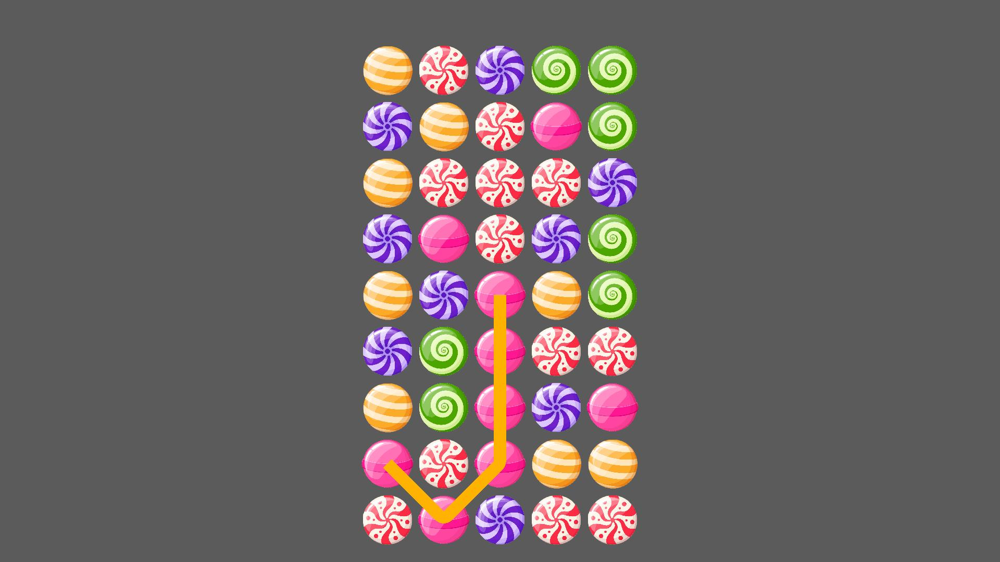
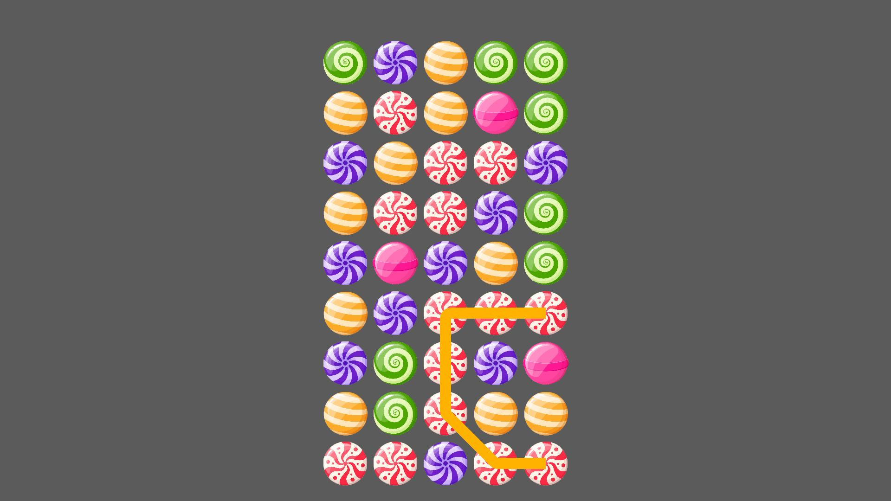
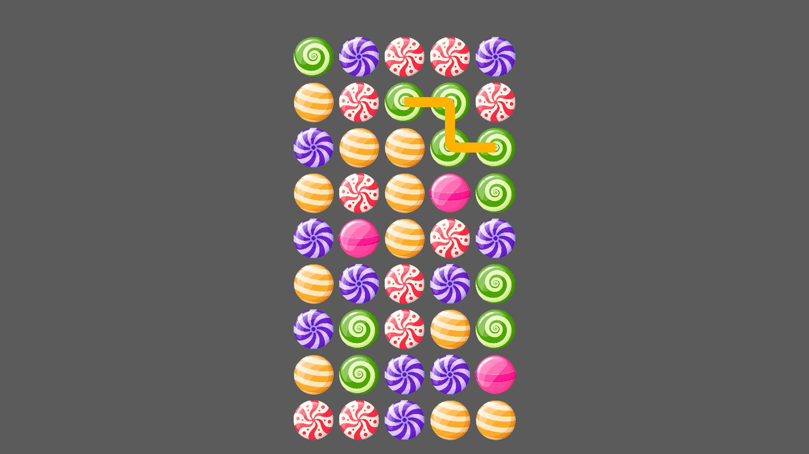

# Unity Candy Popping Game With LineRenderer
The mechanic of popping candy that I wrote in a game I made as a freelance before, just aligning the candy and popping candy by drawing lines.

**NOTE: there may be better ways to make a game like this or it could be written in a more optimized way (object pooling etc)**

# About 
***In short, this is a game mechanic where you can select and explode the same type of candies by drawing a line. 
You can draw the line horizontally, vertically and crosswise and you can reverse the line you have drawn.***

***You can find the package of the game above and there is a video on youtube of how it looks:***
https://youtu.be/N7Om41C9tjA

